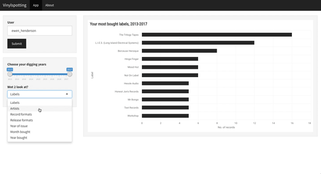

<!-- README.md is generated from README.Rmd. Please edit that file -->

```{r, include = FALSE}
knitr::opts_chunk$set(
  collapse = TRUE,
  comment = "#>",
  fig.path = "man/figures/README-",
  out.width = "100%"
)
```

# vinylspotting



An app to help [Discogs](https://www.discogs.com) users visualise the current state, and evolution of, their record collection and buying habits.

## Use

Visit [apps.ewen.io/vinylspotting](https://apps.ewen.io/vinylspotting/) to use `vinylspotting`.

1. Enter your Discogs user name
2. Have a look around
3. Export any visuals you wanna keep

You can also run the app locally, from an R session, by simply running:

```{r, eval=FALSE}
library(shiny)
runGitHub(repo = "ewenme/vinylspotting", subdir = "inst/shiny")
```

Note: You will be prompted for a Discogs API access token if running `vinylspotting` locally. Refer to [discogger](https://github.com/ewenme/discogger) if you need help.

> *Copyright 2019 [Ewen Henderson](http://ewen.io/). Licensed under the MIT license.*
