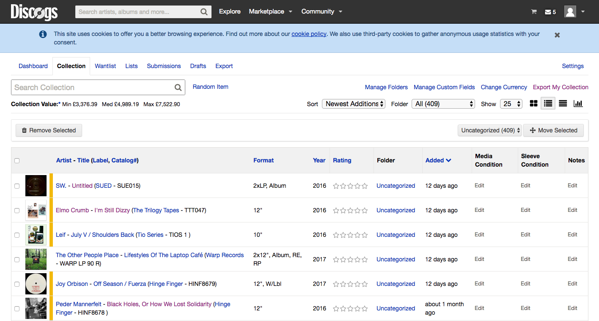

```{r setup, include=FALSE}
knitr::opts_chunk$set(cache=TRUE, echo = TRUE, tidy = TRUE, warning = FALSE, message = FALSE)
```

<br>

## Vinyl: A Discogs Fairytale

At a cursory glance, it's almost impossible to get much of an understanding of vinyl record collections beyond their size (or perhaps their age, depending on the smell?). If you get up close, you might recognise some artist names or make out some titles on the spines of LPs, but your average collector is gonna have loads of bits that even *they* don't recognise on sight. Now, while the unadulterated excitement of finding a [white label](https://en.wikipedia.org/wiki/White_label) on the shelve that even *you* can't remember is the romance at the very heart of record digging, that thought of forgotten artifacts would send archivists and librarians bonkers. 

Enter [Discogs](http://www.discogs.com) - the definitive recorded music database and marketplace, with over 8 million record entries and counting. Aside from catching themselves tumbling through all sorts of audio rabbit-holes, Discogs users are able to forensically catalog their own collection. Once you're at more than a few hundred records, having a well-kept digital archive of your music to refer to is sometimes the only way of knowing "did I already buy that record?", without having to leaf through the physical lot.

A user can browse through the individual pages of each of their records, but when the user wants to look at their overall collection they see something like this:

<br>



<br>

It's essentially a tabulated view of your collection with rudimentary info, and some record sleeve thumbnails to boot. The 'collection value' is a new (and very addictive) addition that, as far as I can tell, is the **only** summary statistic on show (besides the count), which got me into thinking:

### **If I had put the work in to ammassing a couple thousand records, say, it would be cool to know more about my record collection than just how much it's worth.**

The obvious next thought was, "R could probably help with that".

<br>

## Getting hot 'n' heavy with the Discogs API 

Off the bat, I needed to develop a sensible pipeline for accessing and tidying the metadata of a user's collection. The RESTful Discogs API would now be my good friend. A skim through the documentation [here](https://www.discogs.com/developers/) gets us to the [user collection](https://www.discogs.com/developers/#page:user-collection,header:user-collection-collection) section, showing you how to request to view a users collection with just their username (of course, there's an app registration and OAuth key/token business to go through first). User collections are [paginated](https://www.discogs.com/developers/#page:home,header:home-pagination), too, but we can employ a loop to build up a simple request to the API endpoint and get sight of a whole collection:

Here's what a simple call to the Discogs user collection API endpoint looks like:

```{r Discogs user collection API request eg}

library(RCurl)
library(jsonlite)
library(httr)
library(tidyverse)

# create empty list for the collection pages
pages <- list()

# Loop through each page of the collection, adding release data to the list
for(i in 1:9){
  mydata <- fromJSON(paste0("https://api.discogs.com//users/ewen_henderson/collection/folders/0/releases", "?page=", i), flatten=TRUE)
  message("Retrieving page ", i)
  pages[[i+1]] <- mydata$releases
}

# bind these pages together
glimpse(as.data.frame(rbind.pages(pages)))

```

<br>

This gives us our first sight of the users collection, but there's still a lot of 'nested' data to contend with (e.g. labels, artists, formats) before we have a wholesome view of the collection. As mentioned, the desired endgame was a function that would extract and tidy up a user's collection with as much metadata intact as possible. That went like so:

```{r final getCollection function}

require(data.table)

getCollection <- function(username){
  
  #call API to retrieve raw users collection
  baseURL <- "https://api.discogs.com//users/"
  tailURL <- "/collection/folders/0/releases"
  user_agent <-  'DiscogsViz/1.0'

  pre_run <- getURL(paste0(baseURL, username, tailURL),
                    httpheader=c('User-Agent'=user_agent))
  pre_run <- fromJSON(pre_run)
  
  #loop through collection pages and bind to dataframe
  pages <- list()
  for(i in 1:pre_run$pagination$pages){
    mydata <- fromJSON(paste0(baseURL, username,
                              tailURL, "?page=", i), flatten=TRUE)
    message("Retrieving page ", i)
    pages[[i+1]] <- mydata$releases
  }
  data <- rbind.pages(pages)
  data <- as.data.table(data)
  data <- data[!duplicated(data), ]
  
  #flatten and clean label info
  labels <- unnest(data, basic_information.labels)
  valid_column_names <- make.names(names=names(labels), unique=TRUE, allow_ = TRUE)
  names(labels) <- valid_column_names
  
  labels <- labels %>%
    select(instance_id, name, catno, resource_url)  %>%
    rename(label_name = name, label_url = resource_url) %>%
    filter(!duplicated(instance_id))
  
  #flatten and clean format info
  formats <- unnest(data, basic_information.formats) %>%
    select(instance_id, descriptions:text) %>%
    rename(format_name=name, format_text=text) %>%
    unnest(descriptions)
  
  formats <- formats[!duplicated(formats), ]
  
  formats <- formats %>%
    spread(key=descriptions, value=descriptions) %>%
    filter(!duplicated(instance_id))
  
  #flatten and clean artist info
  artists <- unnest(data, basic_information.artists)
  valid_column_names <- make.names(names=names(artists), unique=TRUE, allow_ = TRUE)
  names(artists) <- valid_column_names
  
  artists <- artists %>%
    select(instance_id, name, basic_information.title, resource_url) %>%
    rename(artist_name=name, artist_url=resource_url) %>%
    filter(!duplicated(instance_id))
  
  #bind this all together (apart from formats, they need a separate join)
  data <- select(data, instance_id:rating, basic_information.year)
  data <- cbind(data, artists, labels, id="instance_id")
  
  #make col names unique
  valid_column_names <- make.names(names=names(data), unique=TRUE, allow_ = TRUE)
  names(data) <- valid_column_names
  
  #remove unneeded cols
  data <- select(data, -rating, -instance_id.1, -instance_id.2)
  
  data <- left_join(data, formats, by = c("instance_id"="instance_id"))
}

test <- getCollection("ewen_henderson")

glimpse(test)
```

<br>

Voila. Note that there are variables in here that I haven't really looked at yet, but keeping them in for now means it would be quite easy to explore them further if there's a reason to.

About time for some analysis...

<br>

## Unpacking "it would be cool to know more stuff"

Once I had eyes on the data at hand, the proper fun/tricky stuff could play out i.e. how do I take someones record collection data and translate it back visually, in a useful and coherent way?

A few concepts were prominent in my head-space:

* Part of what makes a record collection unique and special is how it **evolves over time**: it's not static and intakes distinct phases. I had to find a way to make this temporal element a central thread.
* Aside from insight about what's *in* their collection, something else that could be interpreted from the date records were added was **user's buying patterns.**
* The **on-rails-exploration experience of a Shiny app** seemed like a suitable environment to aid record collectors' discovery, essentially as **a natural, digital extension of the digging process.**
* The app should mirror the treasured and personal state of the subject matter. In keeping, the **language adopted should be idiosyncratic and approachable.**

The resulting product is available for diggers everywhere (psst...if you ain't, try it out with my username 'ewen_henderson') over [here](https://ewenme.shinyapps.io/vinylspotting/), and a little showcase below. 

<iframe src='https://gfycat.com/ifr/CapitalTallImago' frameborder='0' scrolling='no' width='640' height='347' ></iframe>

Shiny's a hard thing to do justice to in markdown, so head straight over there to get a flavour and refer to the [github repo](https://github.com/ewenme/Vinylspotting) if you want to see the Shiny code.

I hope some data science/Discogs enthusiast hybrids out there have just found their Mecca, but I'll settle for people from either fraternity finding something useful in this.

<br>

## More work (yawn)

There are some things that would be cool to incorporate into future iterations. The most glaring omission is any kind of spend analytics - unfortunately, Discogs don't offer up their marketplace sales data in the public API offering (though there has been previous for publications to get exclusive access (hint, hint)) so for now, it's off limits. Something that I chose to exclude was record's rating data (i.e. what the average rating for a record was), which felt like it could be noise in an app that would explore a single user's collection and, thus, would mostly contain records that person already rated highly (i.e. they bought it).

With time, an interesting exercise could be to fit a time series model to user's collections to provide a forecast of the size of their collection in the future. The recently open-sourced [Prophet](https://facebookincubator.github.io/prophet/) could be a suitably flexible procedure to implement in a Shiny app environment. Hold tight for that blog post...
